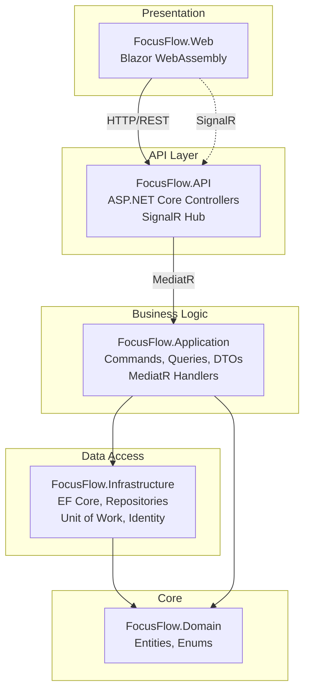
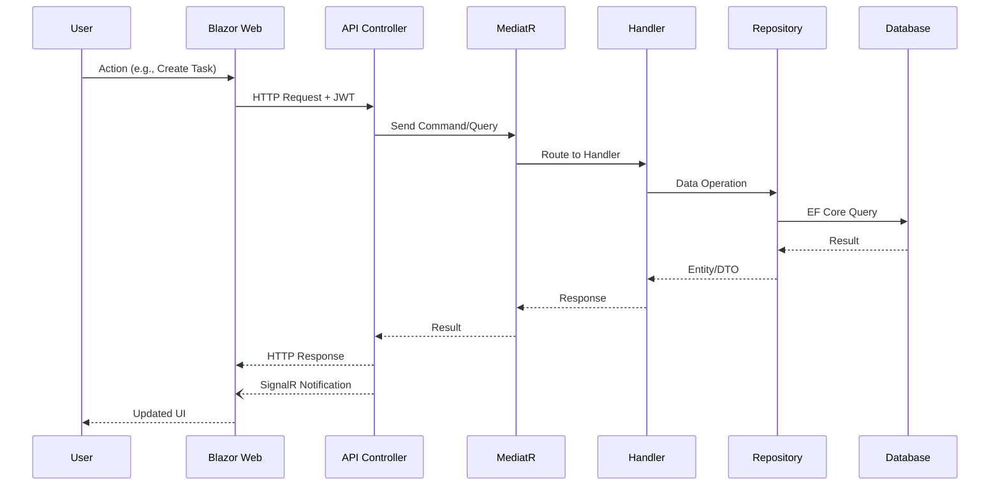

# FocusFlow

A task management application built with .NET 8, Blazor WebAssembly, and Entity Framework Core.

## Prerequisites

- [.NET 8 SDK](https://dotnet.microsoft.com/download/dotnet/8.0)
- [Docker Desktop](https://www.docker.com/products/docker-desktop/) (for containerized run)
- SQL Server (LocalDB for development, or use Docker)

## Quick Start

### Using Docker (Recommended)

```bash
docker compose up -d
```

This starts:
- **Web App**: http://localhost:5001
- **API**: http://localhost:5000
- **Swagger**: http://localhost:5000/swagger
- **SQL Server**: localhost,1433

To stop:
```bash
docker compose down
```

### Local Development

1. Update the connection string in `FocusFlow.API/appsettings.json` if needed

2. Run the API:
```bash
dotnet run --project FocusFlow.API
```

3. Run the Web app (in a separate terminal):
```bash
dotnet run --project FocusFlow.Web
```

- API: https://localhost:7002
- Web: https://localhost:7139

## Running Tests

```bash
dotnet test
```

## Database Access (Docker)

Connect using SQL Server Management Studio or Azure Data Studio:

| Setting | Value |
|---------|-------|
| Server | `localhost,1433` |
| Username | `sa` |
| Password | `FocusFlow2026!` |
| Database | `FocusFlowDb` |

## Architecture

The solution follows Clean Architecture with CQRS pattern:



### Request Flow



### Project Structure

| Project | Purpose |
|---------|---------|
| FocusFlow.Domain | Core entities (Project, TaskItem) and enums |
| FocusFlow.Application | Business logic, CQRS handlers, DTOs, interfaces |
| FocusFlow.Infrastructure | Data access, EF Core, repositories, ASP.NET Identity |
| FocusFlow.API | REST API controllers, JWT authentication |
| FocusFlow.Web | Blazor WebAssembly frontend |
| FocusFlow.Tests | Unit tests |

## Decision Log

| Decision | Reasoning |
|----------|-----------|
| Blazor WebAssembly | Client-side SPA with full .NET ecosystem, no JavaScript required |
| CQRS with MediatR | Separates read/write operations, cleaner code organization |
| Repository + Unit of Work | Abstracts data access, easier testing and maintenance |
| JWT Authentication | Stateless auth suitable for API + SPA architecture |
| EF Core InMemory for tests | Fast test execution without database dependency |
| Nginx for Web container | Lightweight server for static Blazor files |
| SignalR | Real-time task updates across browser sessions |

## Third-Party Packages

| Package | Purpose |
|---------|---------|
| MediatR | CQRS pattern implementation |
| AutoMapper | Object-to-object mapping |
| FluentValidation | Request validation |
| Blazored.LocalStorage | JWT token storage in browser |
| xUnit | Test framework |
| Moq | Mocking for unit tests |
| FluentAssertions | Readable test assertions |
| SignalR | Real-time task updates |

## API Endpoints

| Method | Endpoint | Description |
|--------|----------|-------------|
| POST | /api/auth/register | Register new user |
| POST | /api/auth/login | Login, returns JWT |
| GET | /api/auth/me | Get current user |
| GET | /api/projects | List user's projects |
| POST | /api/projects | Create project |
| PUT | /api/projects/{id} | Update project |
| DELETE | /api/projects/{id} | Delete project |
| GET | /api/tasks | List tasks (with filters) |
| POST | /api/tasks | Create task |
| PUT | /api/tasks/{id} | Update task |
| DELETE | /api/tasks/{id} | Delete task |
| GET | /api/dashboard | Get dashboard statistics |

Full API documentation available at `/swagger` when running.
